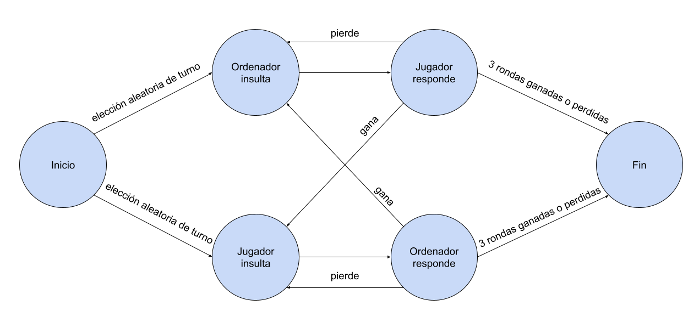

# PEC 1 - Un juego de aventura

## Cómo jugar
Al iniciar el juego, se escoge de forma aleatoria quién empieza.

Si empieza el jugador, deberá escoger un insulto de la lista que aparecerá en la pantalla. A continuación, el ordenador escogerá una respuesta. En modo fácil, el ordenador escoge una respuesta aleatoria entre todas las opciones. En modo difícil, tiene una posibilidad de acertar de más del 50%.

Si, por lo contrario, empieza el ordenador, se escogerá un insulto aleatorio y el jugador deberá escoger la respuesta.

Si el jugador que responde acierta, gana un punto. Si falla, en cambio, el otro jugador se lleva el punto.

El juego termina cuando uno de los dos jugadores llega a 3 puntos.

## Estructura e implementación
El juego se divide en tres escenas: el menú, la escena de juego y la escena final.

En el menú, tenemos dos botones: jugar y salir, que, como sus nombres indican, inician la escena de juego y cierran la aplicación, respectivamente. Esto está implementado en el script MenuManager, que se encarga de todos los métodos relacionados con cambios de escenas o cierre de la aplicación.

La escena de juego, por su parte, está estructurada mediante una máquina de estados basada en la siguiente estructura:

Cada estado hereda de la clase abstracta BaseState que los obliga a tener una corrutina `EnterState(GameplayManager gameplayManager)`. Esta corrutina se encargará, en cada caso, de llamar a los métodos de la clase GameplayManager que necesite ese estado. Los estados de jugador, además, tienen una segunda corrutina, `OptionSelected(GameplayManager gameplayManager, string selectedText)`, que se encarga de la funcionalidad cuando el jugador selecciona una de las opciones de texto.

Tenemos 5 estados: StartGameState, PlayerInsultsState, ComputerInsultsState, PlayerAnswersState y ComputerAnswersState. Al inicio de juego, el GameplayManager inicia el primer estado: StartGameState, desde el que se decidirá aleatoriamente el primer turno y se pasará al siguiente estado dependiendo de ello. Si el primer turno es del jugador, se pasará al estado PlayerInsultsState, desde el que se actualizará la interfaz para que muestre todos los insultos. Una vez el jugador seleccione uno de los insultos, el método de GameplayManager asignado al botón seleccionado llamará a la corrutina de selección de opciones, que se encargará de actualizar la interfaz, y, tras dos segundos, pasar al siguiente estado, ComputerAnswersState. Si, en cambio, el primer turno es del ordenador, se pasará al estado ComputerInsultsState. Desde este, se escogerá un insulto aleatorio, se actualizará la interfaz, y, tras dos segundos, se pasará al estado de respuesta del jugador, PlayerAnswersState. Si volvemos al estado ComputerAnswersState, vemos que este se encarga de que el GameplayManager escoja una respuesta y actualice la interfaz. A continuación, espera dos segundos antes de comprobar quién es el ganador de la ronda y actualizar la interfaz para mostrarlo. Finalmente, tras otros dos segundos, comprueba si el juego ha terminado, y si no es así, pasa al estado de insulto del ganador del turno. El PlayerAnswersState, por su parte, al entrar al estado se comporta de forma similar al PlayerInsultsState, actualizando la interfaz para que muestre las opciones y teniendo una segunda corrutina para cuando se selecciona una de las opciones. Esta segunda corrutina, en cambio, se comporta del mismo modo que el estado ComputerAnswersState. Actualiza la interfaz, espera dos segundos, comprueba el ganador de la ronda y espera otros dos segundos, y finalmente, comprueba si ha acabado el juego y, de no ser así, pasa el turno al ganador de la ronda.

En el GameplayManager, por su parte, encontramos varios métodos similares entre ellos que se encargan de activar o desactivar los elementos de la interfaz y otros que se encargan de actualizar dichos elementos de interfaz. Estos son los llamados `Activate[...]UI(bool activate)`, y los llamados `Update[...]UI(...)`, respectivamente. Por otra parte, vemos más concretamente el método `PopulateUI(TypeOfTurn typeOfTurn)`, que añade las opciones de insultos o respuestas que tiene el jugador, mediante un prefab, y añade a sus botones un listener en el evento onClick, que llamará al método `PlayerChoice(string selectedOption, int index)`, que, a su vez, iniciará la corrutina `OptionSelected(GameplayManager gameplayManager, string selectedText)` de los estados del jugador de la que ya hemos hablado. Encontramos, además, un método para la elección aleatoria de insulto o respuesta de los turnos del ordenador, `ChooseRandom(TypeOfTurn typeOfTurn)`, además del método de elección aleatoria del turno inicial, `RandomizeTurn()`, y de un método `ChangeState(BaseState state)`, que pasará de un estado a otro y actualizará el estado actual. Finalmente, tenemos los métodos encargados de determinar el ganador de la ronda y el ganador del juego, `CheckRoundWinner()` y `CheckGameWinner()`.

Por otro lado, tenemos una clase FileReader que se encarga de convertir el archivo json a arrays de strings y cuyo método `ReadFile(TypeOfTurn dataType)` será llamado en el `Start()` del GameplayManager para obtener tanto los insultos, como las respuestas. Para la conversión, es necesario crear un tipo de dato que siga la misma estructura que el json. Hemos hecho, por esto, un struct llamado Data, que contiene un array de otra estructura de datos, DataEntry, que a su vez, contiene los dos strings: insult y answer.

Además, como ya hemos comentado, hemos añadido dos niveles de difcultad. Para controlar estos, encontramos una clase DifficultyManager que se encarga de controlar los botones que determinan dicho nivel y que contiene la variable estática que el GameplayManager utilizará para decidir cómo el ordenador escoge la respuesta a los insultos.

Vemos, también, que en el proyecto hemos utilizado tres enums para definir tres datos determinados: el jugador, el nivel de dificultad y el tipo de turno. Esto nos ayuda a usar un único método para funcionalidades similares sin tener que recurrir a cadenas de texto que fácilmente pueden contener errores y que resultan más difíciles de controlar.

En la escena final, vemos quién ha ganado la partida y cuántas rondas ha ganado cada jugador, además de tener dos botones para volver al menú y para volver a jugar. Los botones, como en el menú, estan controlados por el MenuManager. Para el texto correspondiente al ganador y las rondas ganadas, en cambio, hemos creado una nueva clase, EndScreenManager, que se encargará de actualizar la interfaz con los datos que, anteriormente, hemos almacenado en la escena de juego mediante una clase estática, ScoreManager.

## Sprites y sonidos
Todos los sprites utilizados han sido hechos por mi mediante el programa Inkscape.

En el caso de los efectos de sonido, se han realizado con el programa Bfxr. Los sonidos utilizados para los diálogos son dos secuencias distintas compuestas en Audacity utilizando dos sonidos creados con el programa ya mencionado.

La música de fondo, por su parte, ha sido descargada de la página [OpenGameArt](https://opengameart.org/). Se trata de dos clips de sonido con licencia CC0. Son [Intro Music](https://opengameart.org/content/intro-music-0) de [RonyDKid](https://opengameart.org/users/ronydkid), utilizada en las pantallas de menú y de final; y [Battle Theme A](https://opengameart.org/content/battle-theme-a) de [cynicmusic](https://opengameart.org/users/cynicmusic), utilizada en la escena de juego.

## Builds
Se han hecho builds tanto para Windows, como para WebGL y Android. Para este último, además, se ha usado el DeviceSimulator, gracias al que se pudieron adaptar los canvas para que en ningún dispositivo desapareciera el texto.

Los tres builds se pueden encontrar [aquí](https://fuscor.itch.io/p2d-pec1-un-juego-de-aventuras).

## Vídeo

